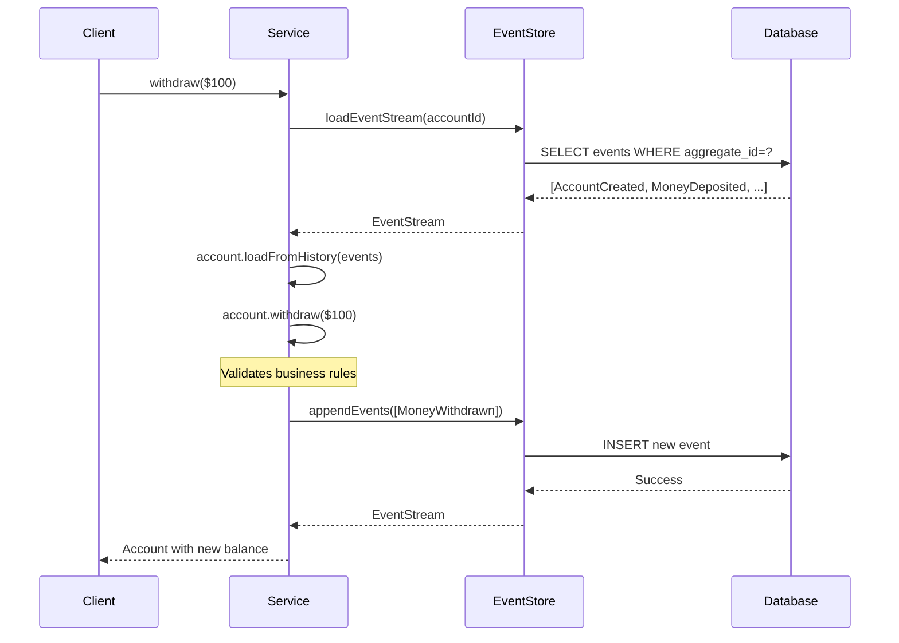

# Firefly Event Sourcing Library 🚀

A **production-ready** Spring Boot library for implementing Event Sourcing with reactive programming, designed specifically for high-scale financial applications.

> **What is Event Sourcing?** Instead of storing just the current state of your data, Event Sourcing stores all the events that led to that state. Think of it like a bank statement - you see every transaction, not just the final balance.

## Why Event Sourcing? 💡

**Traditional Approach:**
```sql
UPDATE accounts SET balance = 900 WHERE id = 'acc-123';
-- ❌ Lost: How? When? Who? Why?
```

**Event Sourcing Approach:**
```json
[
  {"type": "AccountCreated", "balance": 1000, "timestamp": "2023-01-15T10:00:00Z"},
  {"type": "MoneyWithdrawn", "amount": 100, "atm": "Main St", "timestamp": "2023-01-15T14:30:00Z"}
]
// ✅ Complete audit trail + current state (calculated from events)
```

**Perfect for Banking & Finance:**
- 📋 **Complete audit trail** for regulatory compliance
- 🔍 **Fraud detection** through transaction pattern analysis  
- ⏰ **Time travel** - recreate any state at any point in time
- 📊 **Rich analytics** - answer complex business questions
- 🔄 **Event replay** for testing new business rules

## 🎯 **Getting Started**

### ⚠️ **Is Event Sourcing Right for You?**

**Use Event Sourcing when you need:**
- ✅ Complete audit trail (banking, healthcare, legal)
- ✅ Time-travel queries (regulatory compliance)
- ✅ Event-driven architecture
- ✅ Complex domain with rich business logic
- ✅ Fraud detection and pattern analysis
- ✅ Debugging production issues (replay events)

**Consider Traditional CRUD instead when:**
- ❌ Simple CRUD operations
- ❌ No audit trail requirements
- ❌ Performance is critical (event replay has overhead)
- ❌ Simple domain logic

---

### New to Event Sourcing?
Start with our **step-by-step tutorial** that builds a complete Account Ledger system:
👉 **[Complete Tutorial: Building an Account Ledger](./docs/tutorial-account-ledger.md)**

This tutorial covers:
- ✅ All event sourcing concepts explained with real examples
- ✅ Why each component is necessary (aggregates, events, snapshots, read models, projections)
- ✅ Complete working code from start to finish
- ✅ Best practices and common patterns
- ✅ Advanced topics (concurrency, sagas, multi-tenancy)

### Already Familiar with Event Sourcing?
- **[Quick Start Guide](./docs/quick-start.md)** - Get up and running in 5 minutes
- **[Event Sourcing Explained](./docs/event-sourcing-explained.md)** - Deep dive into concepts
- **[API Reference](./docs/api-reference.md)** - Complete API documentation

## ⚡ **What This Library Provides**

Everything you need to build production-ready event-sourced applications:

### 🏗️ **Core Framework**
- **Domain-Driven Design** - Rich aggregates with clear business rules
- **Event Store Abstraction** - Clean interfaces for different storage backends
- **Aggregate Framework** - Base classes with automatic event handling
- **Event Streaming** - Reactive event processing with backpressure

### 🗄️ **PostgreSQL-Optimized Persistence**
- **R2DBC Integration** - Non-blocking database operations
- **JSONB Storage** - Efficient JSON querying and indexing
- **Database Migrations** - Flyway scripts for schema management
- **Connection Pooling** - Production-ready connection management

### 📊 **Production Features**
- **Monitoring & Metrics** - Built-in Micrometer integration
- **Health Checks** - Comprehensive system health indicators
- **Performance Optimization** - Snapshots, batching, and caching
- **Distributed Tracing** - Automatic request tracing

### 🧪 **Testing & Development**
- **Testcontainers Integration** - Real PostgreSQL testing
- **H2 Support** - Fast in-memory testing
- **Comprehensive Documentation** - From concepts to production
- **Spring Boot Auto-Configuration** - Zero-configuration setup

## Understanding the Architecture: Account Ledger Example

This library uses a **complete Account Ledger** as the reference implementation. Let's understand why each component is necessary:

### 🗄️ **Critical: What Gets a Database Table?**

**The Golden Rule of Event Sourcing:**

| Component | Has Table? | Why? |
|-----------|------------|------|
| **Events** | ✅ YES (`events` table) | Source of truth, immutable history |
| **Snapshots** | ✅ YES (`snapshots` table) | Performance optimization |
| **Read Models** | ✅ YES (`account_ledger_read_model`) | Fast queries (traditional table!) |
| **Aggregates** | ❌ **NO TABLE** | Reconstructed from events in-memory |

```java
// ❌ WRONG: Do NOT create a table for aggregates
@Table("account_ledger")  // ← This defeats event sourcing!
public class AccountLedger extends AggregateRoot { }

// ✅ CORRECT: Aggregates have no @Table annotation
public class AccountLedger extends AggregateRoot {
    // Lives in memory only!
    // Reconstructed from events when needed
}

// ✅ CORRECT: Read models DO have tables
@Table("account_ledger_read_model")  // ← For fast queries
public class AccountLedgerReadModel { }
```

**Why This Matters:**
- If you create a table for your aggregate, you're doing **traditional CRUD**, not event sourcing
- The aggregate's state is **derived from events**, not stored directly
- Read models are **projections** built from events for query performance

---

### The Components

```
┌─────────────────────────────────────────────────────────────────┐
│                    WRITE SIDE (Commands)                         │
│                                                                  │
│  Client Request                                                  │
│       ↓                                                          │
│  AccountLedgerService (orchestration)                           │
│       ↓                                                          │
│  AccountLedger Aggregate (business rules)                       │
│       ↓                                                          │
│  Events (MoneyDepositedEvent, etc.)                             │
│       ↓                                                          │
│  EventStore (PostgreSQL events table)                           │
└────────────────────────────┬────────────────────────────────────┘
                             │
                             │ Events Published
                             │
                             ▼
┌─────────────────────────────────────────────────────────────────┐
│                    READ SIDE (Queries)                           │
│                                                                  │
│  AccountLedgerProjectionService (event listener)                │
│       ↓                                                          │
│  AccountLedgerReadModel (denormalized view)                     │
│       ↓                                                          │
│  AccountLedgerRepository (queries)                              │
│       ↓                                                          │
│  Fast Query Results                                             │
└─────────────────────────────────────────────────────────────────┘
```

### Why Do We Need Each Component?

#### 1. **Domain Events** (e.g., `MoneyDepositedEvent`)
- **What**: Immutable records of things that happened
- **Why**: The source of truth - complete audit trail
- **Storage**: ✅ `events` table
- **Example**: `MoneyDepositedEvent{amount: 100, source: "ATM", depositedBy: "user-123"}`

#### 2. **Aggregate Root** (`AccountLedger`)
- **What**: Business logic that enforces rules and generates events
- **Why**: Ensures business rules are never violated (e.g., no withdrawals from frozen accounts)
- **Storage**: ❌ **NO TABLE** - Lives in memory only!
- **Example**: `account.withdraw(100)` → validates balance → generates `MoneyWithdrawnEvent`

#### 3. **Event Store** (PostgreSQL `events` table)
- **What**: Append-only log of all events
- **Why**: Permanent, immutable record of everything that happened
- **Storage**: ✅ `events` table
- **Example**: Stores events in order with metadata (timestamp, user, correlation ID)

#### 4. **Snapshots** (`AccountLedgerSnapshot`)
- **What**: Cached state at a specific version
- **Why**: Performance - avoid replaying millions of events
- **Storage**: ✅ `snapshots` table
- **Example**: Instead of replaying 1M events, load snapshot at version 999,000 + replay 1,000 events (100x faster!)

#### 5. **Service Layer** (`AccountLedgerService`)
- **What**: Orchestrates loading aggregates, executing commands, saving events
- **Why**: Handles infrastructure concerns (transactions, retries, logging)
- **Storage**: ❌ No table - Pure business logic
- **Example**: `service.deposit(accountId, 100)` → loads aggregate → executes → saves

#### 6. **Read Model** (`AccountLedgerReadModel`)
- **What**: Denormalized view optimized for queries
- **Why**: Fast queries without replaying events
- **Storage**: ✅ `account_ledger_read_model` table (traditional table!)
- **Example**: `SELECT * FROM account_ledger_read_model WHERE balance > 10000` (instant!)
- **Important**: This is a **traditional table** that gets updated by projections

#### 7. **Projection Service** (`AccountLedgerProjectionService`)
- **What**: Keeps read model in sync with events
- **Why**: Maintains eventual consistency between write and read sides
- **Storage**: ❌ No table - Event handler logic
- **Example**: Listens to `MoneyDepositedEvent` → updates balance in read model table

#### 8. **Repository** (`AccountLedgerRepository`)
- **What**: Data access layer for read model
- **Why**: Clean abstraction for querying the read model table
- **Storage**: ❌ No table - Queries the `account_ledger_read_model` table
- **Example**: `repository.findByCustomerId(customerId)` - fast, indexed queries

### The Flow

**WRITE (Command):**
```
Deposit $100 → Service → Aggregate validates → MoneyDepositedEvent → EventStore
```

**READ (Query):**
```
Get balance → Repository → ReadModel table → Return instantly (no event replay!)
```

**PROJECTION (Sync):**
```
MoneyDepositedEvent → ProjectionService → Update ReadModel balance
```

### Why This Separation?

**Traditional Approach:**
```sql
UPDATE accounts SET balance = balance + 100 WHERE id = 'acc-123';
SELECT balance FROM accounts WHERE id = 'acc-123';
-- ❌ Lost: Who deposited? When? Why? From where?
-- ❌ Can't answer: "What was the balance yesterday?"
```

**Event Sourcing with Read Models:**
```java
// WRITE: Complete audit trail
MoneyDepositedEvent{amount: 100, source: "ATM", depositedBy: "user-123", timestamp: "..."}

// READ: Fast queries from read model
SELECT balance FROM account_ledger_read_model WHERE id = 'acc-123';  -- Instant!

// TIME TRAVEL: Replay events to any point in time
getBalanceAt("2025-10-17T15:30:00Z")  -- What was the balance yesterday at 3:30 PM?
```

**Benefits:**
- ✅ **Complete Audit Trail**: Every transaction recorded forever
- ✅ **Time Travel**: Reconstruct state at any point in time
- ✅ **Fast Queries**: Read model optimized for queries
- ✅ **Scalability**: Scale reads and writes independently
- ✅ **Business Intelligence**: Analyze transaction patterns
- ✅ **Regulatory Compliance**: SOX, PCI-DSS, GDPR requirements met

👉 **[See the complete tutorial for detailed explanations and code](./docs/tutorial-account-ledger.md)**

---

## Quick Start

### 1. Add Dependency

```xml
<dependency>
    <groupId>com.firefly</groupId>
    <artifactId>lib-common-eventsourcing</artifactId>
    <version>1.0.0-SNAPSHOT</version>
</dependency>
```

### 2. Configuration

```yaml
firefly:
  eventsourcing:
    enabled: true
    store:
      type: r2dbc
      batch-size: 100
    snapshot:
      enabled: true
      threshold: 50
    publisher:
      enabled: true
      type: KAFKA
      destination-prefix: events
```

### 3. Create Domain Events (Account Ledger Example)

```java
// Event 1: Account opened
@DomainEvent("account.opened")
@SuperBuilder
@Getter
@NoArgsConstructor
@AllArgsConstructor
public class AccountOpenedEvent extends AbstractDomainEvent {
    private String accountNumber;
    private String accountType;
    private UUID customerId;
    private BigDecimal initialDeposit;
    private String currency;
}

// Event 2: Money deposited
@DomainEvent("money.deposited")
@SuperBuilder
@Getter
@NoArgsConstructor
@AllArgsConstructor
public class MoneyDepositedEvent extends AbstractDomainEvent {
    private BigDecimal amount;
    private String source;        // "ATM", "Wire Transfer", etc.
    private String reference;     // External reference number
    private String depositedBy;   // User who made the deposit
}

// Event 3: Money withdrawn
@DomainEvent("money.withdrawn")
@SuperBuilder
@Getter
@NoArgsConstructor
@AllArgsConstructor
public class MoneyWithdrawnEvent extends AbstractDomainEvent {
    private BigDecimal amount;
    private String destination;
    private String reference;
    private String withdrawnBy;
}
```

### 4. Implement Aggregate Root (Business Logic)

```java
public class AccountLedger extends AggregateRoot {
    private String accountNumber;
    private BigDecimal balance;
    private boolean frozen;
    private boolean closed;

    // Constructor for creating NEW accounts
    public AccountLedger(UUID id, String accountNumber, String accountType,
                         UUID customerId, BigDecimal initialDeposit, String currency) {
        super(id, "AccountLedger");

        // Validate
        if (initialDeposit.compareTo(BigDecimal.ZERO) < 0) {
            throw new IllegalArgumentException("Initial deposit cannot be negative");
        }

        // Generate event
        applyChange(AccountOpenedEvent.builder()
            .aggregateId(id)
            .accountNumber(accountNumber)
            .accountType(accountType)
            .customerId(customerId)
            .initialDeposit(initialDeposit)
            .currency(currency)
            .build());
    }

    // Constructor for LOADING from events
    public AccountLedger(UUID id) {
        super(id, "AccountLedger");
    }

    // Command: Deposit money
    public void deposit(BigDecimal amount, String source, String reference, String depositedBy) {
        if (closed) throw new AccountClosedException("Cannot deposit to closed account");
        if (frozen) throw new AccountFrozenException("Cannot deposit to frozen account");
        if (amount.compareTo(BigDecimal.ZERO) <= 0) {
            throw new IllegalArgumentException("Deposit amount must be positive");
        }

        applyChange(MoneyDepositedEvent.builder()
            .aggregateId(id)
            .amount(amount)
            .source(source)
            .reference(reference)
            .depositedBy(depositedBy)
            .build());
    }

    // Command: Withdraw money
    public void withdraw(BigDecimal amount, String destination, String reference, String withdrawnBy) {
        if (closed) throw new AccountClosedException("Cannot withdraw from closed account");
        if (frozen) throw new AccountFrozenException("Cannot withdraw from frozen account");
        if (balance.compareTo(amount) < 0) {
            throw new InsufficientFundsException("Insufficient funds");
        }

        applyChange(MoneyWithdrawnEvent.builder()
            .aggregateId(id)
            .amount(amount)
            .destination(destination)
            .reference(reference)
            .withdrawnBy(withdrawnBy)
            .build());
    }

    // Event Handler: Apply AccountOpenedEvent
    @EventHandler
    public void apply(AccountOpenedEvent event) {
        this.accountNumber = event.getAccountNumber();
        this.balance = event.getInitialDeposit();
        this.frozen = false;
        this.closed = false;
    }

    // Event Handler: Apply MoneyDepositedEvent
    @EventHandler
    public void apply(MoneyDepositedEvent event) {
        this.balance = this.balance.add(event.getAmount());
    }

    // Event Handler: Apply MoneyWithdrawnEvent
    @EventHandler
    public void apply(MoneyWithdrawnEvent event) {
        this.balance = this.balance.subtract(event.getAmount());
    }
}
```

### 5. Create Service Layer with @EventSourcingTransactional

```java
@Service
public class AccountLedgerService {
    private final EventStore eventStore;
    private final SnapshotStore snapshotStore;

    // Open new account
    @EventSourcingTransactional
    public Mono<AccountLedger> openAccount(String accountNumber, String accountType,
                                           UUID customerId, BigDecimal initialDeposit,
                                           String currency) {
        return Mono.fromCallable(() -> {
            UUID accountId = UUID.randomUUID();
            return new AccountLedger(accountId, accountNumber, accountType,
                                     customerId, initialDeposit, currency);
        });
        // ✅ Events automatically saved and published!
    }

    // Deposit money
    @EventSourcingTransactional
    public Mono<AccountLedger> deposit(UUID accountId, BigDecimal amount,
                                       String source, String reference, String depositedBy) {
        return loadAggregate(accountId)
            .map(ledger -> {
                ledger.deposit(amount, source, reference, depositedBy);
                return ledger;
            });
        // ✅ Events automatically saved and published!
    }

    // Load aggregate (with snapshot optimization)
    private Mono<AccountLedger> loadAggregate(UUID accountId) {
        return snapshotStore.loadLatestSnapshot(accountId, AccountLedgerSnapshot.class)
            .flatMap(snapshot -> {
                AccountLedger ledger = AccountLedger.fromSnapshot(snapshot);
                return eventStore.loadEvents(accountId, snapshot.getVersion() + 1, Long.MAX_VALUE)
                    .collectList()
                    .map(events -> {
                        if (!events.isEmpty()) ledger.loadFromHistory(events);
                        return ledger;
                    });
            })
            .switchIfEmpty(
                eventStore.loadEvents(accountId)
                    .collectList()
                    .map(events -> {
                        AccountLedger ledger = new AccountLedger(accountId);
                        ledger.loadFromHistory(events);
                        return ledger;
                    })
            );
    }
}
```

### 6. Create Read Model for Fast Queries

```java
// Read Model Entity
@Data
@Builder
@Table("account_ledger_read_model")
public class AccountLedgerReadModel {
    @Id
    private UUID accountId;
    private String accountNumber;
    private UUID customerId;
    private BigDecimal balance;
    private String currency;
    private boolean frozen;
    private boolean closed;
    private String status;  // "ACTIVE", "FROZEN", "CLOSED"
}

// Repository for Fast Queries
@Repository
public interface AccountLedgerRepository extends R2dbcRepository<AccountLedgerReadModel, UUID> {
    Mono<AccountLedgerReadModel> findByAccountNumber(String accountNumber);
    Flux<AccountLedgerReadModel> findByCustomerId(UUID customerId);

    @Query("SELECT * FROM account_ledger_read_model WHERE balance > :minBalance")
    Flux<AccountLedgerReadModel> findByBalanceGreaterThan(BigDecimal minBalance);
}
```

### 7. Create Projection to Keep Read Model in Sync

```java
@Service
public class AccountLedgerProjectionService extends ProjectionService<AccountLedgerReadModel> {

    private final AccountLedgerRepository repository;

    @Override
    protected Mono<Void> handleEvent(EventEnvelope envelope) {
        Event event = envelope.getEvent();

        if (event instanceof AccountOpenedEvent e) {
            // Create read model
            AccountLedgerReadModel readModel = AccountLedgerReadModel.builder()
                .accountId(e.getAggregateId())
                .accountNumber(e.getAccountNumber())
                .customerId(e.getCustomerId())
                .balance(e.getInitialDeposit())
                .currency(e.getCurrency())
                .frozen(false)
                .closed(false)
                .status("ACTIVE")
                .build();
            return repository.save(readModel).then();

        } else if (event instanceof MoneyDepositedEvent e) {
            // Update balance
            return repository.findById(e.getAggregateId())
                .flatMap(readModel -> {
                    readModel.setBalance(readModel.getBalance().add(e.getAmount()));
                    return repository.save(readModel);
                })
                .then();
        }

        return Mono.empty();
    }
}
```

### 8. Use It!

```java
@RestController
@RequestMapping("/api/accounts")
public class AccountController {

    private final AccountLedgerService service;
    private final AccountLedgerRepository repository;

    // WRITE: Open account (uses aggregate)
    @PostMapping
    public Mono<AccountLedger> openAccount(@RequestBody OpenAccountRequest request) {
        return service.openAccount(
            request.getAccountNumber(),
            request.getAccountType(),
            request.getCustomerId(),
            request.getInitialDeposit(),
            request.getCurrency()
        );
    }

    // WRITE: Deposit money (uses aggregate)
    @PostMapping("/{accountId}/deposit")
    public Mono<AccountLedger> deposit(@PathVariable UUID accountId,
                                       @RequestBody DepositRequest request) {
        return service.deposit(accountId, request.getAmount(),
                              request.getSource(), request.getReference(),
                              request.getDepositedBy());
    }

    // READ: Get account (uses read model - FAST!)
    @GetMapping("/{accountId}")
    public Mono<AccountLedgerReadModel> getAccount(@PathVariable UUID accountId) {
        return repository.findById(accountId);
    }

    // READ: Get customer accounts (uses read model - FAST!)
    @GetMapping("/customer/{customerId}")
    public Flux<AccountLedgerReadModel> getCustomerAccounts(@PathVariable UUID customerId) {
        return repository.findByCustomerId(customerId);
    }

    // READ: High balance accounts (uses read model - FAST!)
    @GetMapping("/high-balance")
    public Flux<AccountLedgerReadModel> getHighBalanceAccounts() {
        return repository.findByBalanceGreaterThan(new BigDecimal("10000"));
    }
}
```

**That's it!** You now have:
- ✅ Complete audit trail (events in EventStore)
- ✅ Business rules enforced (in AccountLedger aggregate)
- ✅ Fast queries (AccountLedgerReadModel)
- ✅ Automatic synchronization (AccountLedgerProjectionService)
- ✅ ACID transactions (@EventSourcingTransactional)
- ✅ Time travel capabilities (replay events to any point in time)

👉 **[See the complete tutorial for detailed explanations](./docs/tutorial-account-ledger.md)**

## 🧩 Core Concepts

Understand the building blocks of event sourcing:

### 📋 **Events** - Facts About What Happened

Events are **immutable records** of things that happened in your business domain.

```java
@JsonTypeName("money.withdrawn")
public record MoneyWithdrawnEvent(
    UUID aggregateId,           // Which account?
    BigDecimal amount,          // How much?
    String reason,              // Why?
    String atmLocation,         // Where?
    Instant timestamp           // When?
) implements Event {
    @Override
    public String getEventType() { return "money.withdrawn"; }
}
```

**Key Principles:**
- 📅 **Past Tense Names** - `AccountCreated`, not `CreateAccount`
- 🔒 **Immutable** - Once created, never changed
- 📦 **Self-Contained** - All necessary data included
- 🏷️ **Well-Typed** - Use `@JsonTypeName` for serialization

**Real Banking Example:**
```json
{
  "eventType": "money.withdrawn",
  "aggregateId": "acc-12345",
  "amount": 100.00,
  "reason": "ATM Withdrawal",
  "atmLocation": "Main Street Branch",
  "timestamp": "2023-10-18T14:30:00Z",
  "metadata": {
    "userId": "user-789",
    "deviceId": "atm-001",
    "correlationId": "txn-456"
  }
}
```

### 🏗️ **Aggregates** - Business Logic + State

Aggregates are **consistency boundaries** that encapsulate business rules and generate events.

```java
public class Account extends AggregateRoot {
    // Current state (derived from events)
    private BigDecimal balance;
    private String accountNumber;
    private AccountStatus status;
    
    // Business logic (validates and generates events)
    public void withdraw(BigDecimal amount, String reason) {
        // 1. Validate business rules
        if (status != AccountStatus.ACTIVE) {
            throw new AccountNotActiveException();
        }
        if (balance.compareTo(amount) < 0) {
            throw new InsufficientFundsException();
        }
        if (amount.compareTo(BigDecimal.ZERO) <= 0) {
            throw new InvalidAmountException();
        }
        
        // 2. Generate event (what happened)
        applyChange(new MoneyWithdrawnEvent(
            getId(), amount, reason, 
            determineLocation(), Instant.now()
        ));
    }
    
    // Event handler (how state changes)
    private void on(MoneyWithdrawnEvent event) {
        this.balance = this.balance.subtract(event.amount());
        // State is derived from events!
    }
}
```

**Key Principles:**
- 🛡️ **Consistency Boundary** - All business rules enforced
- 🎯 **Single Responsibility** - One aggregate = one business concept
- 📊 **State from Events** - Current state calculated from event history
- 🔄 **Event Sourcing Pattern** - Command → Validation → Event → State Change

### 🗄️ **Event Store** - The Source of Truth

The Event Store is your **database for events** - it persists and retrieves the complete event history.

```java
@Service
public class AccountService {
    private final EventStore eventStore;
    
    public Mono<Account> handleWithdrawal(UUID accountId, BigDecimal amount) {
        return eventStore
            // 1. Load complete event history
            .loadEventStream(accountId, "Account")
            
            // 2. Reconstruct current state from events
            .map(stream -> {
                Account account = new Account(accountId);
                account.loadFromHistory(stream.getEvents()); // Replay all events
                return account;
            })
            
            // 3. Execute business logic
            .doOnNext(account -> account.withdraw(amount, "ATM"))
            
            // 4. Persist new events
            .flatMap(account -> eventStore.appendEvents(
                accountId, "Account", 
                account.getUncommittedEvents(), 
                account.getVersion() // Optimistic locking
            ))
            .map(stream -> account);
    }
}
```

**Event Store Capabilities:**
- 💾 **Atomic Persistence** - All events saved or none (ACID)
- 🔒 **Optimistic Locking** - Prevents concurrent modification conflicts  
- 📈 **Global Ordering** - Events have sequence numbers across all aggregates
- 🔍 **Rich Querying** - Stream events by type, time range, aggregate
- ⚡ **Reactive Streams** - Non-blocking operations with backpressure

**Real Database Schema:**
```sql
-- PostgreSQL with JSONB for performance
CREATE TABLE events (
    event_id UUID PRIMARY KEY,
    aggregate_id UUID NOT NULL,
    aggregate_version BIGINT NOT NULL,     -- For optimistic locking
    global_sequence BIGSERIAL,             -- Global event ordering  
    event_type VARCHAR(255) NOT NULL,      -- 'money.withdrawn'
    event_data JSONB NOT NULL,             -- Full event as JSON
    metadata JSONB,                        -- Correlation, user, etc.
    created_at TIMESTAMP WITH TIME ZONE
);
```

### 📸 **Snapshots** - Performance Optimization

Snapshots are **saved states** that speed up aggregate loading when you have many events.

**Creating Snapshots with AbstractSnapshot:**

```java
// 1. Define your snapshot by extending AbstractSnapshot
@Getter
public class AccountLedgerSnapshot extends AbstractSnapshot {
    private final String accountNumber;
    private final BigDecimal balance;
    private final String currency;

    public AccountLedgerSnapshot(UUID aggregateId, long version, Instant createdAt,
                                String accountNumber, BigDecimal balance, String currency) {
        super(aggregateId, version, createdAt);
        this.accountNumber = accountNumber;
        this.balance = balance;
        this.currency = currency;
    }

    @Override
    public String getSnapshotType() {
        return "AccountLedger";
    }
}

// 2. Create snapshots in your aggregate
public AccountLedgerSnapshot createSnapshot() {
    return new AccountLedgerSnapshot(
        getId(), getCurrentVersion(), Instant.now(),
        accountNumber, balance, currency
    );
}

// 3. Restore from snapshot
public static AccountLedger fromSnapshot(AccountLedgerSnapshot snapshot) {
    AccountLedger account = new AccountLedger(snapshot.getAggregateId());
    account.accountNumber = snapshot.getAccountNumber();
    account.balance = snapshot.getBalance();
    account.currency = snapshot.getCurrency();
    account.setCurrentVersion(snapshot.getVersion());
    return account;
}
```

**Performance Comparison:**

```java
// Without snapshots (slow for old accounts)
Account account = new Account(accountId);
account.loadFromHistory(events); // Could be 10,000+ events!

// With snapshots (much faster)
Snapshot snapshot = snapshotStore.loadLatest(accountId);
Account account = Account.fromSnapshot(snapshot);
account.loadFromHistory(eventsAfterSnapshot); // Only recent events!
```

**How Snapshots Work:**

1. **Automatic Creation** - After N events (configurable threshold)
   ```yaml
   firefly:
     eventsourcing:
       snapshot:
         threshold: 50  # Create snapshot every 50 events
   ```

2. **Smart Loading** - Event store checks for snapshots first
   ```java
   // Library automatically:
   // 1. Loads latest snapshot (if exists)
   // 2. Loads events since snapshot
   // 3. Reconstructs current state
   Account account = eventStore.loadAggregate(accountId, Account.class);
   ```

3. **Configurable Strategy**
   ```yaml
   firefly:
     eventsourcing:
       snapshot:
         enabled: true
         threshold: 50          # Events before snapshot
         keep-count: 3          # Keep last 3 snapshots  
         compression: true      # Compress snapshot data
         caching: true          # Cache in memory
   ```

**Real Performance Impact:**
```
Without Snapshots:
- Account with 1000 events: ~500ms load time
- Account with 10000 events: ~5000ms load time

With Snapshots (threshold=50):
- Account with 1000 events: ~50ms load time
- Account with 10000 events: ~50ms load time
```

### 🔄 **How It All Works Together**



**🎯 The Beauty of This Pattern:**
- **📋 Complete Audit Trail** - Every change is recorded forever
- **🔄 Business Logic Clarity** - Rules are explicit in aggregates
- **⚡ Performance** - Snapshots handle large event streams
- **🔒 Data Integrity** - Optimistic locking prevents conflicts
- **📊 Rich Analytics** - Query events for insights and reporting

## Architecture

```
┌─────────────────┐    ┌─────────────────┐    ┌─────────────────┐
│   Application   │    │   Domain Layer  │    │  Infrastructure │
│    Services     │    │   (Aggregates)  │    │     Layer       │
└─────────────────┘    └─────────────────┘    └─────────────────┘
         │                       │                       │
         ▼                       ▼                       ▼
┌─────────────────┐    ┌─────────────────┐    ┌─────────────────┐
│  Event Store    │    │     Events      │    │   EDA Publisher │
│   Interface     │    │   & Streams     │    │   Integration   │
└─────────────────┘    └─────────────────┘    └─────────────────┘
         │                                             │
         ▼                                             ▼
┌─────────────────┐                          ┌─────────────────┐
│  Persistence    │                          │   Message       │
│   Adapters      │                          │   Brokers       │
│  (R2DBC, etc.)  │                          │ (Kafka, etc.)   │
└─────────────────┘                          └─────────────────┘
```

## Configuration Properties

### Event Store
```yaml
firefly:
  eventsourcing:
    store:
      type: r2dbc                    # Event store type
      batch-size: 100                # Batch size for operations
      connection-timeout: 30s        # Connection timeout
      query-timeout: 30s             # Query timeout
      validate-schemas: true         # Validate event schemas
      max-events-per-load: 1000      # Max events per load
```

### Snapshots
```yaml
firefly:
  eventsourcing:
    snapshot:
      enabled: true                  # Enable snapshots
      threshold: 50                  # Events before snapshot
      check-interval: 5m             # Snapshot check frequency
      keep-count: 3                  # Snapshots to keep
      max-age: 30d                   # Maximum snapshot age
      compression: true              # Compress snapshots
      caching: true                  # Enable snapshot caching
```

### Publisher
```yaml
firefly:
  eventsourcing:
    publisher:
      enabled: true                  # Enable event publishing
      type: KAFKA                    # Publisher type
      destination-prefix: events     # Topic/queue prefix
      async: true                    # Async publishing
      batch-size: 10                # Publishing batch size
      continue-on-failure: true     # Continue on publish failures
```

## Database Schema

### PostgreSQL (R2DBC)
```sql
CREATE TABLE events (
    event_id UUID PRIMARY KEY,
    aggregate_id UUID NOT NULL,
    aggregate_type VARCHAR(255) NOT NULL,
    aggregate_version BIGINT NOT NULL,
    global_sequence BIGSERIAL UNIQUE,
    event_type VARCHAR(255) NOT NULL,
    event_data JSONB NOT NULL,
    metadata JSONB,
    created_at TIMESTAMP WITH TIME ZONE DEFAULT NOW(),
    UNIQUE(aggregate_id, aggregate_version)
);

CREATE INDEX idx_events_aggregate ON events(aggregate_id, aggregate_type);
CREATE INDEX idx_events_global_sequence ON events(global_sequence);
CREATE INDEX idx_events_type ON events(event_type);
CREATE INDEX idx_events_created_at ON events(created_at);
```

### Snapshots Table
```sql
CREATE TABLE snapshots (
    snapshot_id UUID PRIMARY KEY,
    aggregate_id UUID NOT NULL,
    aggregate_type VARCHAR(255) NOT NULL,
    version BIGINT NOT NULL,
    snapshot_type VARCHAR(255) NOT NULL,
    snapshot_data JSONB NOT NULL,
    created_at TIMESTAMP WITH TIME ZONE DEFAULT NOW(),
    UNIQUE(aggregate_id, version)
);

CREATE INDEX idx_snapshots_aggregate ON snapshots(aggregate_id, aggregate_type);
CREATE INDEX idx_snapshots_version ON snapshots(version);
```

## Best Practices

1. **Event Design**
   - Keep events small and focused
   - Make events immutable
   - Use meaningful event names
   - Include all necessary data

2. **Aggregate Design**
   - Keep aggregates small
   - Maintain consistency boundaries
   - Avoid loading multiple aggregates in a single transaction
   - Use eventual consistency between aggregates

3. **Performance**
   - Use snapshots for aggregates with many events
   - Configure appropriate batch sizes
   - Monitor event store performance
   - Consider read model projections

4. **Error Handling**
   - Handle concurrency exceptions gracefully
   - Implement proper retry mechanisms
   - Monitor failed event publishing
   - Use circuit breakers for external dependencies

## 📖 Documentation

Comprehensive guides to help you master event sourcing:

### 🎓 **Learning Path**
1. **[Event Sourcing Explained](./docs/event-sourcing-explained.md)** - *Start here!* Understanding concepts, benefits, and when to use
2. **[Quick Start Guide](./docs/quick-start.md)** - Build your first event-sourced app in 5 minutes
3. **[Improved Developer Experience](./docs/examples/improved-developer-experience.md)** - Learn to use AbstractDomainEvent and enhanced AggregateRoot
4. **[Banking Example](./docs/examples/banking-example.md)** - Complete real-world example with explanations

### 📚 **Reference Guides**
- **[Architecture Overview](./docs/architecture.md)** - System design and component interactions
- **[API Reference](./docs/api-reference.md)** - Detailed interface documentation with examples
- **[Configuration Reference](./docs/configuration.md)** - All configuration options explained
- **[Testing Guide](./docs/testing.md)** - Testing strategies with Testcontainers
- **[Database Schema](./docs/database-schema.md)** - Schema design and migration scripts

### 💡 **Pro Tips**
- **New to event sourcing?** → Start with [Event Sourcing Explained](./docs/event-sourcing-explained.md)
- **Want to see it working?** → Check the [Banking Example](./docs/examples/banking-example.md)
- **Ready for production?** → Read [Testing Guide](./docs/testing.md) and [Configuration Reference](./docs/configuration.md)

## Integration with Other Firefly Libraries

- **lib-common-r2dbc**: Reactive database access, filtering, pagination utilities, and transaction management
- **lib-common-eda**: Event publishing to message brokers
- **lib-common-cache**: Snapshot caching

## Monitoring

The library provides several monitoring capabilities:

- **Health Indicators**: Event store and snapshot store health
- **Metrics**: Event throughput, latencies, errors
- **Distributed Tracing**: Automatic trace propagation
- **Statistics**: Event counts, storage usage

## Testing

Use the provided test utilities for testing event-sourced aggregates:

```java
@Test
void testAccountWithdrawal() {
    UUID accountId = UUID.randomUUID();
    Account account = new Account(accountId, "12345", BigDecimal.valueOf(1000));
    
    account.withdraw(BigDecimal.valueOf(100));
    
    assertEquals(BigDecimal.valueOf(900), account.getBalance());
    assertEquals(1, account.getUncommittedEventCount());
}
```

## License

Licensed under the Apache License, Version 2.0.