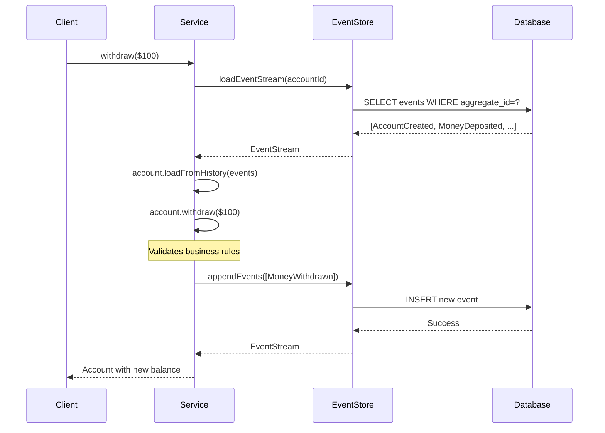

# Firefly Event Sourcing Library 🚀

A **production-ready** Spring Boot library for implementing Event Sourcing with reactive programming, designed specifically for high-scale financial applications.

> **What is Event Sourcing?** Instead of storing just the current state of your data, Event Sourcing stores all the events that led to that state. Think of it like a bank statement - you see every transaction, not just the final balance.

## Why Event Sourcing? 💡

**Traditional Approach:**
```sql
UPDATE accounts SET balance = 900 WHERE id = 'acc-123';
-- ❌ Lost: How? When? Who? Why?
```

**Event Sourcing Approach:**
```json
[
  {"type": "AccountCreated", "balance": 1000, "timestamp": "2023-01-15T10:00:00Z"},
  {"type": "MoneyWithdrawn", "amount": 100, "atm": "Main St", "timestamp": "2023-01-15T14:30:00Z"}
]
// ✅ Complete audit trail + current state (calculated from events)
```

**Perfect for Banking & Finance:**
- 📋 **Complete audit trail** for regulatory compliance
- 🔍 **Fraud detection** through transaction pattern analysis  
- ⏰ **Time travel** - recreate any state at any point in time
- 📊 **Rich analytics** - answer complex business questions
- 🔄 **Event replay** for testing new business rules

## 🎯 **New to Event Sourcing?** 
Start with our comprehensive guide: **[Event Sourcing Explained](./docs/event-sourcing-explained.md)**

## ⚡ **What This Library Provides**

Everything you need to build production-ready event-sourced applications:

### 🏗️ **Core Framework**
- **Domain-Driven Design** - Rich aggregates with clear business rules
- **Event Store Abstraction** - Clean interfaces for different storage backends
- **Aggregate Framework** - Base classes with automatic event handling
- **Event Streaming** - Reactive event processing with backpressure

### 🗄️ **PostgreSQL-Optimized Persistence**
- **R2DBC Integration** - Non-blocking database operations
- **JSONB Storage** - Efficient JSON querying and indexing
- **Database Migrations** - Flyway scripts for schema management
- **Connection Pooling** - Production-ready connection management

### 📊 **Production Features**
- **Monitoring & Metrics** - Built-in Micrometer integration
- **Health Checks** - Comprehensive system health indicators
- **Performance Optimization** - Snapshots, batching, and caching
- **Distributed Tracing** - Automatic request tracing

### 🧪 **Testing & Development**
- **Testcontainers Integration** - Real PostgreSQL testing
- **H2 Support** - Fast in-memory testing
- **Comprehensive Documentation** - From concepts to production
- **Spring Boot Auto-Configuration** - Zero-configuration setup

## Quick Start

### 1. Add Dependency

```xml
<dependency>
    <groupId>com.firefly</groupId>
    <artifactId>lib-common-eventsourcing</artifactId>
    <version>1.0.0-SNAPSHOT</version>
</dependency>
```

### 2. Configuration

```yaml
firefly:
  eventsourcing:
    enabled: true
    store:
      type: r2dbc
      batch-size: 100
    snapshot:
      enabled: true
      threshold: 50
    publisher:
      enabled: true
      type: KAFKA
      destination-prefix: events
```

### 3. Create Domain Events

```java
@JsonTypeName("account.created")
public record AccountCreatedEvent(
    UUID aggregateId,
    String accountNumber,
    BigDecimal initialBalance
) implements Event {
    
    @Override
    public String getEventType() {
        return "account.created";
    }
}
```

### 4. Implement Aggregates

```java
public class Account extends AggregateRoot {
    private String accountNumber;
    private BigDecimal balance;
    
    public Account(UUID id, String accountNumber, BigDecimal initialBalance) {
        super(id, "Account");
        applyChange(new AccountCreatedEvent(id, accountNumber, initialBalance));
    }
    
    public void withdraw(BigDecimal amount) {
        if (balance.compareTo(amount) < 0) {
            throw new InsufficientFundsException();
        }
        applyChange(new MoneyWithdrawnEvent(getId(), amount));
    }
    
    private void on(AccountCreatedEvent event) {
        this.accountNumber = event.getAccountNumber();
        this.balance = event.getInitialBalance();
    }
    
    private void on(MoneyWithdrawnEvent event) {
        this.balance = this.balance.subtract(event.getAmount());
    }
}
```

### 5. Use Event Store

```java
@Service
public class AccountService {
    
    private final EventStore eventStore;
    
    public Mono<Account> createAccount(String accountNumber, BigDecimal initialBalance) {
        UUID accountId = UUID.randomUUID();
        Account account = new Account(accountId, accountNumber, initialBalance);
        
        return eventStore.appendEvents(
                accountId, 
                "Account", 
                account.getUncommittedEvents(), 
                0L
            )
            .doOnSuccess(stream -> account.markEventsAsCommitted())
            .thenReturn(account);
    }
    
    public Mono<Account> loadAccount(UUID accountId) {
        return eventStore.loadEventStream(accountId, "Account")
                .map(stream -> {
                    Account account = new Account(accountId);
                    account.loadFromHistory(stream.getEvents());
                    return account;
                });
    }
}
```

## 🧩 Core Concepts

Understand the building blocks of event sourcing:

### 📋 **Events** - Facts About What Happened

Events are **immutable records** of things that happened in your business domain.

```java
@JsonTypeName("money.withdrawn")
public record MoneyWithdrawnEvent(
    UUID aggregateId,           // Which account?
    BigDecimal amount,          // How much?
    String reason,              // Why?
    String atmLocation,         // Where?
    Instant timestamp           // When?
) implements Event {
    @Override
    public String getEventType() { return "money.withdrawn"; }
}
```

**Key Principles:**
- 📅 **Past Tense Names** - `AccountCreated`, not `CreateAccount`
- 🔒 **Immutable** - Once created, never changed
- 📦 **Self-Contained** - All necessary data included
- 🏷️ **Well-Typed** - Use `@JsonTypeName` for serialization

**Real Banking Example:**
```json
{
  "eventType": "money.withdrawn",
  "aggregateId": "acc-12345",
  "amount": 100.00,
  "reason": "ATM Withdrawal",
  "atmLocation": "Main Street Branch",
  "timestamp": "2023-10-18T14:30:00Z",
  "metadata": {
    "userId": "user-789",
    "deviceId": "atm-001",
    "correlationId": "txn-456"
  }
}
```

### 🏗️ **Aggregates** - Business Logic + State

Aggregates are **consistency boundaries** that encapsulate business rules and generate events.

```java
public class Account extends AggregateRoot {
    // Current state (derived from events)
    private BigDecimal balance;
    private String accountNumber;
    private AccountStatus status;
    
    // Business logic (validates and generates events)
    public void withdraw(BigDecimal amount, String reason) {
        // 1. Validate business rules
        if (status != AccountStatus.ACTIVE) {
            throw new AccountNotActiveException();
        }
        if (balance.compareTo(amount) < 0) {
            throw new InsufficientFundsException();
        }
        if (amount.compareTo(BigDecimal.ZERO) <= 0) {
            throw new InvalidAmountException();
        }
        
        // 2. Generate event (what happened)
        applyChange(new MoneyWithdrawnEvent(
            getId(), amount, reason, 
            determineLocation(), Instant.now()
        ));
    }
    
    // Event handler (how state changes)
    private void on(MoneyWithdrawnEvent event) {
        this.balance = this.balance.subtract(event.amount());
        // State is derived from events!
    }
}
```

**Key Principles:**
- 🛡️ **Consistency Boundary** - All business rules enforced
- 🎯 **Single Responsibility** - One aggregate = one business concept
- 📊 **State from Events** - Current state calculated from event history
- 🔄 **Event Sourcing Pattern** - Command → Validation → Event → State Change

### 🗄️ **Event Store** - The Source of Truth

The Event Store is your **database for events** - it persists and retrieves the complete event history.

```java
@Service
public class AccountService {
    private final EventStore eventStore;
    
    public Mono<Account> handleWithdrawal(UUID accountId, BigDecimal amount) {
        return eventStore
            // 1. Load complete event history
            .loadEventStream(accountId, "Account")
            
            // 2. Reconstruct current state from events
            .map(stream -> {
                Account account = new Account(accountId);
                account.loadFromHistory(stream.getEvents()); // Replay all events
                return account;
            })
            
            // 3. Execute business logic
            .doOnNext(account -> account.withdraw(amount, "ATM"))
            
            // 4. Persist new events
            .flatMap(account -> eventStore.appendEvents(
                accountId, "Account", 
                account.getUncommittedEvents(), 
                account.getVersion() // Optimistic locking
            ))
            .map(stream -> account);
    }
}
```

**Event Store Capabilities:**
- 💾 **Atomic Persistence** - All events saved or none (ACID)
- 🔒 **Optimistic Locking** - Prevents concurrent modification conflicts  
- 📈 **Global Ordering** - Events have sequence numbers across all aggregates
- 🔍 **Rich Querying** - Stream events by type, time range, aggregate
- ⚡ **Reactive Streams** - Non-blocking operations with backpressure

**Real Database Schema:**
```sql
-- PostgreSQL with JSONB for performance
CREATE TABLE events (
    event_id UUID PRIMARY KEY,
    aggregate_id UUID NOT NULL,
    aggregate_version BIGINT NOT NULL,     -- For optimistic locking
    global_sequence BIGSERIAL,             -- Global event ordering  
    event_type VARCHAR(255) NOT NULL,      -- 'money.withdrawn'
    event_data JSONB NOT NULL,             -- Full event as JSON
    metadata JSONB,                        -- Correlation, user, etc.
    created_at TIMESTAMP WITH TIME ZONE
);
```

### 📸 **Snapshots** - Performance Optimization

Snapshots are **saved states** that speed up aggregate loading when you have many events.

```java
// Without snapshots (slow for old accounts)
Account account = new Account(accountId);
account.loadFromHistory(events); // Could be 10,000+ events!

// With snapshots (much faster)
Snapshot snapshot = snapshotStore.loadLatest(accountId);
Account account = Account.fromSnapshot(snapshot);
account.loadFromHistory(eventsAfterSnapshot); // Only recent events!
```

**How Snapshots Work:**

1. **Automatic Creation** - After N events (configurable threshold)
   ```yaml
   firefly:
     eventsourcing:
       snapshot:
         threshold: 50  # Create snapshot every 50 events
   ```

2. **Smart Loading** - Event store checks for snapshots first
   ```java
   // Library automatically:
   // 1. Loads latest snapshot (if exists)
   // 2. Loads events since snapshot
   // 3. Reconstructs current state
   Account account = eventStore.loadAggregate(accountId, Account.class);
   ```

3. **Configurable Strategy**
   ```yaml
   firefly:
     eventsourcing:
       snapshot:
         enabled: true
         threshold: 50          # Events before snapshot
         keep-count: 3          # Keep last 3 snapshots  
         compression: true      # Compress snapshot data
         caching: true          # Cache in memory
   ```

**Real Performance Impact:**
```
Without Snapshots:
- Account with 1000 events: ~500ms load time
- Account with 10000 events: ~5000ms load time

With Snapshots (threshold=50):
- Account with 1000 events: ~50ms load time
- Account with 10000 events: ~50ms load time
```

### 🔄 **How It All Works Together**



**🎯 The Beauty of This Pattern:**
- **📋 Complete Audit Trail** - Every change is recorded forever
- **🔄 Business Logic Clarity** - Rules are explicit in aggregates
- **⚡ Performance** - Snapshots handle large event streams
- **🔒 Data Integrity** - Optimistic locking prevents conflicts
- **📊 Rich Analytics** - Query events for insights and reporting

## Architecture

```
┌─────────────────┐    ┌─────────────────┐    ┌─────────────────┐
│   Application   │    │   Domain Layer  │    │  Infrastructure │
│    Services     │    │   (Aggregates)  │    │     Layer       │
└─────────────────┘    └─────────────────┘    └─────────────────┘
         │                       │                       │
         ▼                       ▼                       ▼
┌─────────────────┐    ┌─────────────────┐    ┌─────────────────┐
│  Event Store    │    │     Events      │    │   EDA Publisher │
│   Interface     │    │   & Streams     │    │   Integration   │
└─────────────────┘    └─────────────────┘    └─────────────────┘
         │                                             │
         ▼                                             ▼
┌─────────────────┐                          ┌─────────────────┐
│  Persistence    │                          │   Message       │
│   Adapters      │                          │   Brokers       │
│  (R2DBC, etc.)  │                          │ (Kafka, etc.)   │
└─────────────────┘                          └─────────────────┘
```

## Configuration Properties

### Event Store
```yaml
firefly:
  eventsourcing:
    store:
      type: r2dbc                    # Event store type
      batch-size: 100                # Batch size for operations
      connection-timeout: 30s        # Connection timeout
      query-timeout: 30s             # Query timeout
      validate-schemas: true         # Validate event schemas
      max-events-per-load: 1000      # Max events per load
```

### Snapshots
```yaml
firefly:
  eventsourcing:
    snapshot:
      enabled: true                  # Enable snapshots
      threshold: 50                  # Events before snapshot
      check-interval: 5m             # Snapshot check frequency
      keep-count: 3                  # Snapshots to keep
      max-age: 30d                   # Maximum snapshot age
      compression: true              # Compress snapshots
      caching: true                  # Enable snapshot caching
```

### Publisher
```yaml
firefly:
  eventsourcing:
    publisher:
      enabled: true                  # Enable event publishing
      type: KAFKA                    # Publisher type
      destination-prefix: events     # Topic/queue prefix
      async: true                    # Async publishing
      batch-size: 10                # Publishing batch size
      continue-on-failure: true     # Continue on publish failures
```

## Database Schema

### PostgreSQL (R2DBC)
```sql
CREATE TABLE events (
    event_id UUID PRIMARY KEY,
    aggregate_id UUID NOT NULL,
    aggregate_type VARCHAR(255) NOT NULL,
    aggregate_version BIGINT NOT NULL,
    global_sequence BIGSERIAL UNIQUE,
    event_type VARCHAR(255) NOT NULL,
    event_data JSONB NOT NULL,
    metadata JSONB,
    created_at TIMESTAMP WITH TIME ZONE DEFAULT NOW(),
    UNIQUE(aggregate_id, aggregate_version)
);

CREATE INDEX idx_events_aggregate ON events(aggregate_id, aggregate_type);
CREATE INDEX idx_events_global_sequence ON events(global_sequence);
CREATE INDEX idx_events_type ON events(event_type);
CREATE INDEX idx_events_created_at ON events(created_at);
```

### Snapshots Table
```sql
CREATE TABLE snapshots (
    snapshot_id UUID PRIMARY KEY,
    aggregate_id UUID NOT NULL,
    aggregate_type VARCHAR(255) NOT NULL,
    version BIGINT NOT NULL,
    snapshot_type VARCHAR(255) NOT NULL,
    snapshot_data JSONB NOT NULL,
    created_at TIMESTAMP WITH TIME ZONE DEFAULT NOW(),
    UNIQUE(aggregate_id, version)
);

CREATE INDEX idx_snapshots_aggregate ON snapshots(aggregate_id, aggregate_type);
CREATE INDEX idx_snapshots_version ON snapshots(version);
```

## Best Practices

1. **Event Design**
   - Keep events small and focused
   - Make events immutable
   - Use meaningful event names
   - Include all necessary data

2. **Aggregate Design**
   - Keep aggregates small
   - Maintain consistency boundaries
   - Avoid loading multiple aggregates in a single transaction
   - Use eventual consistency between aggregates

3. **Performance**
   - Use snapshots for aggregates with many events
   - Configure appropriate batch sizes
   - Monitor event store performance
   - Consider read model projections

4. **Error Handling**
   - Handle concurrency exceptions gracefully
   - Implement proper retry mechanisms
   - Monitor failed event publishing
   - Use circuit breakers for external dependencies

## 📖 Documentation

Comprehensive guides to help you master event sourcing:

### 🎓 **Learning Path**
1. **[Event Sourcing Explained](./docs/event-sourcing-explained.md)** - *Start here!* Understanding concepts, benefits, and when to use
2. **[Quick Start Guide](./docs/quick-start.md)** - Build your first event-sourced app in 5 minutes
3. **[Banking Example](./docs/examples/banking-example.md)** - Complete real-world example with explanations

### 📚 **Reference Guides**
- **[Architecture Overview](./docs/architecture.md)** - System design and component interactions
- **[API Reference](./docs/api-reference.md)** - Detailed interface documentation with examples
- **[Configuration Reference](./docs/configuration.md)** - All configuration options explained
- **[Testing Guide](./docs/testing.md)** - Testing strategies with Testcontainers
- **[Database Schema](./docs/database-schema.md)** - Schema design and migration scripts

### 💡 **Pro Tips**
- **New to event sourcing?** → Start with [Event Sourcing Explained](./docs/event-sourcing-explained.md)
- **Want to see it working?** → Check the [Banking Example](./docs/examples/banking-example.md)
- **Ready for production?** → Read [Testing Guide](./docs/testing.md) and [Configuration Reference](./docs/configuration.md)

## Integration with Other Firefly Libraries

- **lib-common-r2dbc**: Reactive database access, filtering, pagination utilities, and transaction management
- **lib-common-eda**: Event publishing to message brokers
- **lib-common-cache**: Snapshot caching
- **lib-common-domain**: Domain abstractions
- **lib-common-cqrs**: Command/query separation

## Monitoring

The library provides several monitoring capabilities:

- **Health Indicators**: Event store and snapshot store health
- **Metrics**: Event throughput, latencies, errors
- **Distributed Tracing**: Automatic trace propagation
- **Statistics**: Event counts, storage usage

## Testing

Use the provided test utilities for testing event-sourced aggregates:

```java
@Test
void testAccountWithdrawal() {
    UUID accountId = UUID.randomUUID();
    Account account = new Account(accountId, "12345", BigDecimal.valueOf(1000));
    
    account.withdraw(BigDecimal.valueOf(100));
    
    assertEquals(BigDecimal.valueOf(900), account.getBalance());
    assertEquals(1, account.getUncommittedEventCount());
}
```

## License

Licensed under the Apache License, Version 2.0.