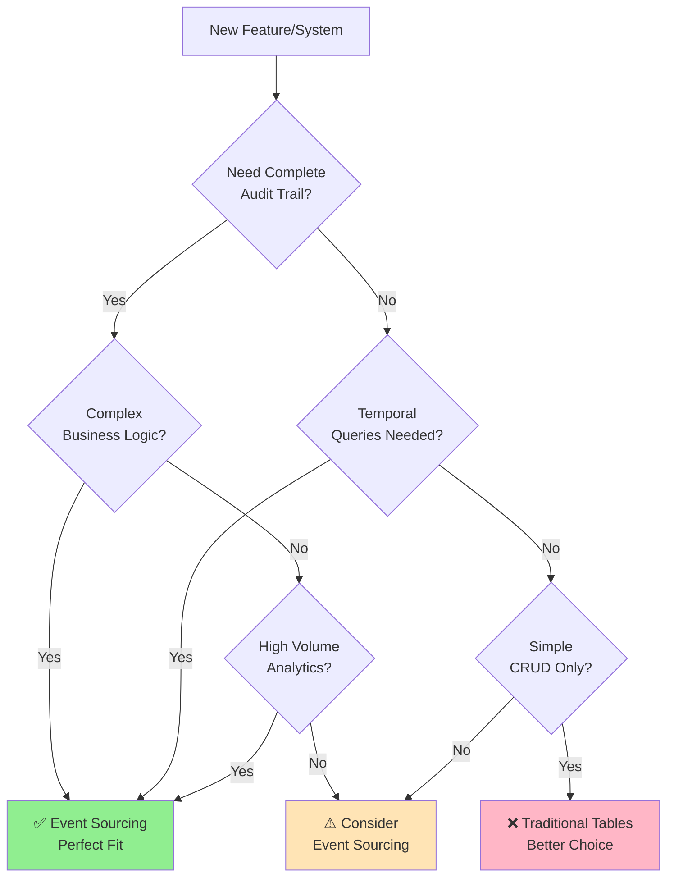

# Event Sourcing Explained 📚

> **💡 Want a complete working example?** Check out our [Account Ledger Tutorial](./tutorial-account-ledger.md) that demonstrates all these concepts with production-ready code.

## What is Event Sourcing? 🤔

Event Sourcing is a powerful architectural pattern that **stores all changes to application state as a sequence of events**. Instead of storing just the current state of data in your database, you store all the events that led to that state.

Think of it like an **Account Ledger** - instead of just showing your current balance, it shows every transaction (deposit, withdrawal, freeze, etc.) that happened to get to that balance.

## The Problem with Traditional CRUD 😰

Let's say you're building a banking system with traditional CRUD:

```sql
-- Traditional approach: Only current state
CREATE TABLE accounts (
    id UUID PRIMARY KEY,
    balance DECIMAL,
    last_updated TIMESTAMP
);

-- What we lose:
-- ❌ How did we get to this balance?
-- ❌ What transactions happened?
-- ❌ When did each change occur?
-- ❌ Who made the changes?
-- ❌ Can we recreate the state at any point in time?
```

**Example: Account with $900 balance**
- Current state: `$900`
- Questions we can't answer:
  - Was this account created with $900?
  - Did someone withdraw $100 from $1000?
  - Did someone deposit $400 to $500?
  - When did the last change happen?

### ⚠️ **Common Misconception: "Just add an aggregate table"**

```sql
-- ❌ WRONG: This is NOT event sourcing!
CREATE TABLE account_ledger (
    id UUID PRIMARY KEY,
    balance DECIMAL,
    status VARCHAR(20),
    frozen BOOLEAN
);
```

**Why this is wrong:**
- ❌ You're storing current state, not events
- ❌ You lose the complete history
- ❌ You can't time-travel or replay events
- ❌ This is just traditional CRUD with extra steps

**The correct approach:**
- ✅ Store events in the `events` table
- ✅ Aggregates live in memory only (no table!)
- ✅ Create read models for queries (separate tables)

## The Event Sourcing Solution ✅

Instead of storing state, we store **events** (facts about what happened):

```sql
-- Event sourcing approach: Store all events
CREATE TABLE events (
    event_id UUID PRIMARY KEY,
    aggregate_id UUID NOT NULL,
    event_type VARCHAR(255) NOT NULL,
    event_data JSONB NOT NULL,
    sequence_number BIGINT,
    created_at TIMESTAMP
);
```

**Same account with event sourcing (Account Ledger):**
```json
[
  {
    "eventType": "AccountOpened",
    "aggregateId": "acc-123",
    "data": {
      "accountNumber": "ACC-2025-001",
      "accountType": "CHECKING",
      "customerId": "cust-456",
      "initialDeposit": 1000,
      "currency": "USD"
    },
    "timestamp": "2023-01-15T10:00:00Z"
  },
  {
    "eventType": "MoneyWithdrawn",
    "aggregateId": "acc-123",
    "data": {
      "amount": 100,
      "destination": "ATM",
      "reference": "ATM-001",
      "withdrawnBy": "user-123"
    },
    "timestamp": "2023-01-15T14:30:00Z"
  }
]

// Current state: $900 (calculated from events)
// We know EVERYTHING that happened! 🎉
```

> **📚 See the [Account Ledger Tutorial](./tutorial-account-ledger.md)** for the complete implementation of this example.

## Key Benefits of Event Sourcing 🚀

### 1. **Complete Audit Trail** 📋
```
Traditional: "Balance is $900" 
Event Sourcing: "Account created with $1000, then $100 withdrawn at Main St ATM on Jan 15 at 2:30 PM"
```

### 2. **Time Travel** ⏰
```java
// What was the balance on January 1st?
Account account = eventStore.loadAggregateAtTime(accountId, "2023-01-01");
BigDecimal balance = account.getBalance(); // Easy!
```

### 3. **Natural Scalability** 📈
```
Events are immutable → Easy to cache
Events are append-only → Easy to replicate  
Events can be processed in parallel → High performance
```

### 4. **Business Intelligence** 📊
```sql
-- Questions you can easily answer:
-- How much money was withdrawn from ATMs this month?
SELECT SUM(amount) FROM events 
WHERE event_type = 'MoneyWithdrawn' 
AND data->>'location' LIKE '%ATM%'
AND created_at >= '2023-01-01';

-- What are the most common transaction amounts?
-- Which accounts have the highest activity?
-- How do transaction patterns change over time?
```

### 5. **Flexibility for Future Requirements** 🔮
```java
// New requirement: "Show all transactions over $500"
// Traditional: Needs database schema changes
// Event Sourcing: Just query existing events!

@EventHandler
public void handle(MoneyWithdrawnEvent event) {
    if (event.getAmount().compareTo(BigDecimal.valueOf(500)) > 0) {
        largeTransactionProjection.record(event);
    }
}
```

## How Event Sourcing Works 🔧

### 1. **Commands** (What you want to do)
```java
public class WithdrawMoneyCommand {
    private UUID accountId;
    private BigDecimal amount;
    private String reason;
}
```

### 2. **Events** (What actually happened)
```java
@JsonTypeName("money.withdrawn")
public record MoneyWithdrawnEvent(
    UUID aggregateId,
    BigDecimal amount, 
    String reason,
    Instant timestamp
) implements Event {
    @Override
    public String getEventType() { return "money.withdrawn"; }
}
```

### 3. **Aggregates** (Business logic + current state)
```java
public class Account extends AggregateRoot {
    private BigDecimal balance;
    private String accountNumber;
    
    // Command handler
    public void withdraw(BigDecimal amount, String reason) {
        if (balance.compareTo(amount) < 0) {
            throw new IllegalArgumentException("Insufficient funds");
        }
        applyChange(new MoneyWithdrawnEvent(getId(), amount, reason, Instant.now()));
    }
    
    // Event handler  
    private void on(MoneyWithdrawnEvent event) {
        this.balance = this.balance.subtract(event.amount());
    }
}
```

### 4. **Event Store** (Persistence)
```java
// Save events
EventStream stream = eventStore.appendEvents(accountId, events, expectedVersion);

// Load events and reconstruct state
Account account = eventStore.loadAggregate(accountId, Account.class);
```

## The Firefly Event Sourcing Architecture 🏗️

### Why We Built It This Way

#### **1. Domain-Driven Design (DDD) Foundation**
```java
// Clear domain concepts
public class Account extends AggregateRoot {
    // Business rules are explicit
    public void withdraw(BigDecimal amount) {
        if (balance.compareTo(amount) < 0) {
            throw new InsufficientFundsException("Cannot withdraw " + amount);
        }
        applyChange(new MoneyWithdrawnEvent(getId(), amount));
    }
}
```

**Why?** Banking business rules are complex. DDD helps us model the real world accurately.

#### **2. Reactive Programming with R2DBC**
```java
// Non-blocking database operations
public Mono<EventStream> appendEvents(UUID aggregateId, List<Event> events) {
    return transactionalOperator.transactional(
        checkConcurrency(aggregateId, expectedVersion)
            .flatMap(currentVersion -> insertEvents(events))
            .map(result -> EventStream.of(aggregateId, events))
    );
}
```

**Why?** Banking systems need high throughput and low latency. Reactive programming handles thousands of concurrent operations efficiently.

#### **3. PostgreSQL with JSONB Optimization**
```sql
-- Efficient JSON querying
CREATE TABLE events (
    event_data JSONB NOT NULL,  -- Native JSON support
    ...
);

-- Fast queries on event data
SELECT * FROM events 
WHERE event_data->>'amount' > '1000'  -- Direct JSON querying
AND event_type = 'money.withdrawn';
```

**Why?** Events have flexible structure. JSONB gives us JSON flexibility with SQL performance.

#### **4. Optimistic Concurrency Control**
```java
public Mono<EventStream> appendEvents(UUID aggregateId, List<Event> events, 
                                    long expectedVersion) {
    return checkConcurrency(aggregateId, expectedVersion)  // Prevent conflicts
        .flatMap(currentVersion -> persistEvents(events));
}
```

**Why?** Multiple users might modify the same account simultaneously. Optimistic locking prevents conflicts without blocking.

#### **5. Comprehensive Monitoring**
```java
@Component 
public class EventStoreMetrics {
    private final Timer appendTimer = Timer.builder("eventstore.append.duration").register(registry);
    private final Counter eventsCounter = Counter.builder("eventstore.events.appended").register(registry);
    
    public void recordAppend(Duration duration, int eventCount) {
        appendTimer.record(duration);
        eventsCounter.increment(eventCount);
    }
}
```

**Why?** Production banking systems need observability. We built-in metrics, health checks, and monitoring.

## 🗄️ **Database Tables in Event Sourcing: What Goes Where?**

This is the most critical concept to understand:

### **Tables You MUST Create:**

#### 1. **Events Table** (Source of Truth)
```sql
CREATE TABLE events (
    event_id UUID PRIMARY KEY,
    aggregate_id UUID NOT NULL,
    event_type VARCHAR(255) NOT NULL,
    event_data JSONB NOT NULL,
    version BIGINT NOT NULL,
    created_at TIMESTAMP
);
```
**Purpose:** Store all domain events (immutable history)

#### 2. **Snapshots Table** (Performance)
```sql
CREATE TABLE snapshots (
    aggregate_id UUID NOT NULL,
    aggregate_type VARCHAR(255) NOT NULL,
    aggregate_version BIGINT NOT NULL,
    snapshot_data JSONB NOT NULL,
    created_at TIMESTAMP
);
```
**Purpose:** Cache aggregate state to avoid replaying millions of events

#### 3. **Read Model Tables** (Queries)
```sql
CREATE TABLE account_ledger_read_model (
    account_id UUID PRIMARY KEY,
    account_number VARCHAR(50),
    balance DECIMAL(19,4),
    currency VARCHAR(3),
    frozen BOOLEAN,
    closed BOOLEAN,
    status VARCHAR(20),
    last_updated TIMESTAMP
);
```
**Purpose:** Fast queries without event replay (traditional table!)

### **Tables You MUST NOT Create:**

#### ❌ **NO Aggregate Table**
```sql
-- ❌ WRONG: Do NOT create this!
CREATE TABLE account_ledger (
    id UUID PRIMARY KEY,
    balance DECIMAL,
    frozen BOOLEAN
);
```

**Why NOT?**
- Aggregates are **reconstructed from events** in memory
- Creating an aggregate table means you're doing CRUD, not event sourcing
- The aggregate's state is **derived**, not stored

### **The Complete Picture:**

```
┌─────────────────────────────────────────────────────────────┐
│                    WRITE SIDE                                │
├─────────────────────────────────────────────────────────────┤
│                                                              │
│  AccountLedger (Aggregate)                                  │
│  ├─ NO TABLE ❌                                             │
│  ├─ Lives in memory only                                    │
│  ├─ Loaded from events table                                │
│  └─ Discarded after command execution                       │
│                                                              │
│  Events                                                      │
│  ├─ HAS TABLE ✅ (events)                                   │
│  ├─ Immutable, append-only                                  │
│  └─ Source of truth                                         │
│                                                              │
│  Snapshots                                                   │
│  ├─ HAS TABLE ✅ (snapshots)                                │
│  └─ Performance optimization                                │
│                                                              │
└─────────────────────────────────────────────────────────────┘

┌─────────────────────────────────────────────────────────────┐
│                    READ SIDE                                 │
├─────────────────────────────────────────────────────────────┤
│                                                              │
│  AccountLedgerReadModel                                     │
│  ├─ HAS TABLE ✅ (account_ledger_read_model)                │
│  ├─ Traditional table with indexes                          │
│  ├─ Updated by projections                                  │
│  └─ Optimized for queries                                   │
│                                                              │
└─────────────────────────────────────────────────────────────┘
```

### **Summary Table:**

| Component | Table? | Table Name | Mutable? | Purpose |
|-----------|--------|------------|----------|---------|
| Events | ✅ YES | `events` | ❌ Append-only | Source of truth |
| Snapshots | ✅ YES | `snapshots` | ❌ Append-only | Performance |
| Read Models | ✅ YES | `*_read_model` | ✅ Updated | Fast queries |
| Aggregates | ❌ **NO** | N/A | N/A | Business logic (in-memory) |

---

## Common Patterns We Implemented 🎯

### **1. Aggregate Pattern**
- Encapsulates business logic
- Maintains consistency boundaries
- Generates events from commands
- **Lives in memory only - NO TABLE!**

### **2. Repository Pattern** 
- `EventStore` abstracts persistence
- Clean separation of domain and infrastructure
- Easy to test and switch implementations

### **3. Read/Write Separation**
- Commands modify state (write side)
- Queries read projections (read side)  
- Optimized for different access patterns

### **4. Transactional Outbox Pattern**
```sql
CREATE TABLE event_outbox (
    outbox_id UUID PRIMARY KEY,
    event_data JSONB NOT NULL,
    status VARCHAR(50) DEFAULT 'PENDING',
    ...
);
```
- Reliable event publishing
- Consistency between database and message bus
- Handles network failures gracefully

### **5. Snapshot Pattern**
```java
// For aggregates with many events
if (eventCount > snapshotThreshold) {
    Snapshot snapshot = createSnapshot(aggregate);
    snapshotStore.save(snapshot);
}
```
- Performance optimization
- Faster aggregate loading
- Configurable thresholds

## When to Use Event Sourcing 🤷‍♂️

### Decision Framework: Event Sourcing vs Traditional Tables



### ✅ **Event Sourcing is Great For:**

| Use Case | Why Event Sourcing Wins | Example |
|----------|------------------------|---------|
| **Financial Systems** | Complete audit trail, regulatory compliance, fraud detection | Banking transactions, payment processing, trading platforms |
| **Complex Business Logic** | Clear separation of commands and events, testable business rules | Insurance claims, order fulfillment, inventory management |
| **Temporal Queries** | Time travel capabilities, state reconstruction at any point | "What was the account balance on Dec 31?" |
| **Analytics & BI** | Rich event history for pattern analysis and reporting | Customer behavior analysis, transaction patterns |
| **Debugging & Support** | Complete history of what happened and why | Customer service investigations, bug reproduction |
| **Event-Driven Architecture** | Natural fit for microservices and async processing | Distributed systems, event-driven microservices |

### ❌ **Traditional Tables are Better For:**

| Use Case | Why Traditional Wins | Example |
|----------|---------------------|---------|
| **Simple CRUD** | Less complexity, faster development | User profiles, application settings, reference data |
| **Low Audit Requirements** | No need for historical data | Cache tables, temporary data, session storage |
| **Rapid Prototyping** | Quick to implement and iterate | MVPs, proof of concepts, internal tools |
| **Small Teams** | Less infrastructure and learning curve | Startups with limited resources |
| **Mostly Static Data** | Infrequent updates, current state is sufficient | Product catalogs, configuration data |

### 🎯 **Comparison Table: Event Sourcing vs Traditional**

| Aspect | Event Sourcing | Traditional Tables |
|--------|---------------|-------------------|
| **Data Storage** | All events (append-only) | Current state only |
| **Audit Trail** | ✅ Complete, automatic | ❌ Requires separate audit tables |
| **Time Travel** | ✅ Built-in | ❌ Not possible without versioning |
| **Complexity** | ⚠️ Higher (events + projections) | ✅ Lower (simple CRUD) |
| **Performance** | ✅ Fast writes (append-only)<br/>⚠️ Reads need projections | ✅ Fast reads<br/>⚠️ Writes can be slow |
| **Scalability** | ✅ Excellent (immutable events) | ⚠️ Moderate (locking, updates) |
| **Debugging** | ✅ Full history available | ❌ Lost information |
| **Analytics** | ✅ Rich event data | ⚠️ Limited to current state |
| **Learning Curve** | ⚠️ Steeper | ✅ Familiar to most developers |
| **Storage Cost** | ⚠️ Higher (all events) | ✅ Lower (current state) |

### 💡 **Hybrid Approach: Best of Both Worlds**

You don't have to choose one or the other! Many successful systems use both:

```java
// Event Sourcing for critical business entities
public class BankAccount extends AggregateRoot {
    // Full event history for transactions
    public void withdraw(BigDecimal amount) {
        applyChange(new MoneyWithdrawnEvent(getId(), amount));
    }
}

// Traditional tables for supporting data
@Entity
public class UserProfile {
    // Simple CRUD for user preferences
    private String displayName;
    private String theme;
    private String language;
}
```

**When to use hybrid:**
- Core business logic → Event Sourcing
- Supporting/reference data → Traditional tables
- User preferences → Traditional tables
- Critical transactions → Event Sourcing

## Real-World Example: Account Ledger 🏦

```java
// Traditional approach - we lose information
@Entity
public class Account {
    private BigDecimal balance; // Only current state
    // Lost: When? How? Who? Why?
}

// Event sourcing approach - complete story (Account Ledger)
public class AccountLedger extends AggregateRoot {
    private BigDecimal balance;
    private boolean frozen;
    private boolean closed;

    public void withdraw(BigDecimal amount, String destination,
                        String reference, String withdrawnBy) {
        // Business rule validation
        validateAccountIsActive();
        if (balance.compareTo(amount) < 0) {
            throw new InsufficientFundsException(getId());
        }

        // Record what happened
        applyChange(new MoneyWithdrawnEvent(
            getId(),
            amount,
            destination,
            reference,
            withdrawnBy
        ));
    }

    @EventHandler
    public void apply(MoneyWithdrawnEvent event) {
        this.balance = this.balance.subtract(event.getAmount());
        // State is derived from events
    }

    private void validateAccountIsActive() {
        if (closed) throw new AccountClosedException(getId());
        if (frozen) throw new AccountFrozenException(getId());
    }
}
```

> **📚 See the complete [Account Ledger Tutorial](./tutorial-account-ledger.md)** for the full implementation with all business rules, events, and patterns.

**Benefits in banking:**
- ✅ Complete transaction history for regulatory compliance
- ✅ Fraud detection through pattern analysis
- ✅ Time travel for dispute resolution
- ✅ Audit trail for regulators
- ✅ Event replay for testing new business rules
- ✅ Account freeze/unfreeze with full history
- ✅ Snapshots for performance with high-volume accounts

## Next Steps 📖

Now that you understand the concepts, explore:

1. **[Account Ledger Tutorial](./tutorial-account-ledger.md)** - Complete guide with working code
2. **[Quick Start Guide](./quick-start.md)** - Build your first event-sourced application
3. **[API Reference](./api-reference.md)** - Detailed interface documentation
4. **[Configuration Guide](./configuration.md)** - Production setup options
5. **[Testing Guide](./testing.md)** - How to test event-sourced systems

Event sourcing might seem complex at first, but it provides powerful capabilities that traditional CRUD cannot match. The Firefly Event Sourcing Library handles the complexity so you can focus on your business logic! 🚀